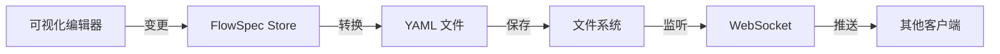

# AgentFlow 项目设计文档

> 版本: v1.0
> 创建日期: 2025-04-22
> 状态: 设计阶段

## 1. 项目概述

AgentFlow 是一个可扩展的 AI Agent 工作流框架，采用 Python 后端 + TypeScript/React 前端架构。项目目标是提供自定义的 agent 工作流编排能力，支持多种节点类型、模型管理、技能市场、流程评估和记忆管理，并通过可视化界面实现实时监控和人工干预。

### 1.1 核心特性

- **可视化流程编排**: 基于 React Flow 的拖拽式流程编辑器
- **多类型节点支持**: MCP Server、Agent Skill、RAG、自定义脚本、条件、循环、并行、人机交互
- **YAML-first 设计**: FlowSpec 规范，所有流程定义通过 YAML 管理，支持版本控制
- **模型管理**: 模型注册、选择、切换和成本优化
- **技能市场**: 技能发现、注册、版本控制和社区评分
- **记忆系统**: 三层记忆架构（短期、中期、长期）
- **实时监控**: 流程可视化、状态追踪、成本分析
- **CLI 支持**: 命令行工具，支持脚本化部署和管理
- **人机协作**: 中断点、审批机制、手动介入

## 2. 市场分析与竞品对比

### 2.1 主流框架对比

| 特性 | LangGraph | CrewAI | AutoGen | n8n | LangFlow | AgentFlow |
|------|-----------|--------|---------|-----|----------|-----------|
| **架构模式** | 图形化状态机 | 多代理协作 | 对话式编排 | 通用自动化 | 可视化拖拽 | YAML-first + 可视化 |
| **语言** | Python | Python | Python | Node.js | Python | Python (后端) + TS (前端) |
| **可视化** | LangGraph Studio | 有限 | CLI | 成熟 | 原生 | React Flow + 实时监控 |
| **GitHub Stars** | 85k+ | 42k+ | 35k+ | 145k+ | 34k+ | - |
| **学习模式** | 静态技能 | 静态角色 | 静态对话 | 静态流程 | 静态节点 | 静态 + 反馈学习 |
| **记忆系统** | 基础 | 基础 | 对话历史 | 基础 | 基础 | 三层架构 |
| **YAML 支持** | 部分 | 无 | 无 | 原生 | 有限 | FlowSpec 核心 |
| **CLI 支持** | LangGraph CLI | 有限 | 原生 | 原生 | 有限 | 原生支持 |
| **开源协议** | MIT | MIT | MIT | Fair Core | Apache 2.0 | MIT |

### 2.2 设计理念参考

#### 2.2.1 OpenClaw 设计理念
[来源: LushBinary Comparison Guide](https://lushbinary.com/blog/hermes-vs-openclaw-key-differences-comparison/)

**核心设计原则**:
- **Gateway-First 架构**: 通过 Gateway 路由消息到 ReAct-loop Brain
- **插件化技能系统**: 社区驱动的 5,700+ 技能生态
- **Markdown-based 记忆**: 简单易读的持久化格式
- **多平台集成**: 原生支持 Telegram、Discord、Slack、WhatsApp 等 20+ 渠道
- **开发者优先**: 强大的开发者工具和生态系统

**AgentFlow 借鉴点**:
```
✓ Gateway 模式：统一的消息和任务路由
✓ 插件化节点：可扩展的节点注册机制
✓ 社区生态：技能市场和开源贡献
✓ 多渠道接入：统一的接入协议
```

#### 2.2.2 Hermes Agent 设计理念
[来源: Nous Research Hermes](https://cognio.so/resources/guides/openclaw-vs-hermes)

**核心设计原则**:
- **学习闭环**: 自动从任务中提取技能，持续自我改进
- **分层记忆架构**: FTS5 + LLM 总结 + 可插拔后端
- **自主技能生成**: 代理自动创建和优化技能文档
- **用户建模**: Honcho 方言建模，深度个性化
- **长期运行**: 24/7 云端自主运行能力

**AgentFlow 借鉴点**:
```
✓ 学习反馈：从执行结果中优化参数
✓ 分层记忆：短期/中期/长期三层架构
✓ 自适应优化：基于历史数据调整流程
✓ 用户画像：长期个性化记忆
```

#### 2.2.3 Harness 架构设计
[来源: Harness Architecture Docs](https://www.harness.io/blog/ci-cd-pipeline)

**核心设计原则**:
- **Pipeline-as-Code**: YAML 定义，版本控制，易于复用
- **Stage/Step 分层**: 清晰的执行阶段和步骤抽象
- **双视图同步**: 可视化编辑器与 YAML 代码双向同步
- **模板系统**: 可复用的流程模板和蓝图
- **持续验证**: 自动化验证和回滚机制

**AgentFlow 借鉴点**:
```
✓ FlowSpec 规范：YAML-first 设计，所有流程通过 YAML 定义
✓ 双向同步：可视化编辑与 YAML 代码实时同步
✓ 模板系统：预定义的流程模板和最佳实践
✓ 验证机制：自动化的流程验证和回滚
```

### 2.3 FlowSpec 设计参考

#### Microsoft Agent Framework Declarative Workflows
[来源: Microsoft Learn](https://learn.microsoft.com/en-us/agent-framework/workflows/declarative)

**关键特性**:
- YAML-based workflow 定义
- 声明式 agent 配置
- 条件路由和并行执行
- 模板和复用机制

```yaml
apiVersion: agent.microsoft.com/v1
kind: Workflow
metadata:
  name: content-pipeline
spec:
  description: "Multi-stage content creation"
  agents:
    - name: researcher
      instructions: "Research the topic..."
      tools: [web_search, vector_db]
  steps:
    - id: research
      agent: researcher
      input: "${topic}"
    - id: write
      agent: writer
      depends_on: [research]
```

#### AgentFlow YAML Specification
[来源: Agentic Ops Framework](https://docs.aof.sh/docs/reference/agentflow-spec/)

**关键特性**:
- 节点类型扩展
- 内联和引用式 agent 定义
- 环境上下文配置
- 条件和循环逻辑

```yaml
apiVersion: aof.dev/v1
kind: AgentFlow
metadata:
  name: docker-diagnostics
spec:
  description: "Docker health check using Script nodes"
  nodes:
    - id: check-status
      type: Script
      config:
        scriptConfig:
          tool: docker
          action: ps
    - id: analyze
      type: Agent
      config:
        inline:
          name: analyzer
          model: google:gemini-2.5-flash
```

### 2.4 分析结论

**AgentFlow 的差异化优势**:

1. **YAML-First 架构**: 优先采用 YAML 定义，保证可追溯性和版本控制
2. **双视图同步**: 可视化编辑器与 YAML 代码实时双向同步
3. **学习闭环**: 结合 Hermes 的学习理念和 OpenClaw 的社区生态
4. **三层记忆**: 短期（会话内）、中期（跨会话）、长期（个性化）记忆
5. **CLI 原生支持**: 命令行工具与 Web UI 功能对等
6. **可扩展节点**: 动态节点注册，支持社区贡献

## 3. 系统架构设计

### 3.1 整体架构

```
┌─────────────────────────────────────────────────────────────┐
│                        AgentFlow 系统                        │
├─────────────────────────────────────────────────────────────┤
│                                                               │
│  ┌─────────────────┐      ┌─────────────────┐              │
│  │   Web UI        │      │   CLI Tool      │              │
│  │   (React+TS)    │      │   (Python)      │              │
│  └────────┬────────┘      └────────┬────────┘              │
│           │                        │                        │
│           └──────────┬─────────────┘                        │
│                      │                                       │
│           ┌──────────▼──────────┐                          │
│           │   Gateway Layer     │                          │
│           │   (REST + WebSocket)│                          │
│           └──────────┬──────────┘                          │
│                      │                                       │
│           ┌──────────▼──────────┐                          │
│           │   Core Engine       │                          │
│           │   (Python)          │                          │
│           └──────────┬──────────┘                          │
│                      │                                       │
│  ┌───────────────────┼───────────────────┐                 │
│  │                   │                   │                  │
│  ▼                   ▼                   ▼                  │
│ ┌────────┐      ┌────────┐      ┌────────┐                │
│ │ Flow   │      │ Model  │      │ Skill  │                │
│ │ Engine │      │ Manager│      │ Market │                │
│ └────────┘      └────────┘      └────────┘                │
│  │       │        │      │        │      │                │
│  ▼       ▼        ▼      ▼        ▼      ▼                │
│ ┌────────┐ ┌────────┐ ┌────────┐ ┌────────┐              │
│ │Memory  │ │Evaluation│ │FlowSpec│ │MCP     │              │
│ │System  │ │Engine  │ │Loader │ │Server  │              │
│ └────────┘ └────────┘ └────────┘ └────────┘              │
│  │              │               │            │              │
│  ▼              ▼               ▼            ▼              │
│ ┌────────┐ ┌────────┐ ┌────────┐ ┌────────┐             │
│ │PostgreSQL│ │Vector  │ │File    │ │External│             │
│ │         │ │DB      │ │System  │ │Systems │             │
│ └────────┘ └────────┘ └────────┘ └────────┘             │
│                                                               │
└─────────────────────────────────────────────────────────────┘
```

### 3.2 后端架构 (Python)

#### 3.2.1 核心模块

```
agentflow/
├── core/                      # 核心引擎
│   ├── engine.py             # 流程执行引擎
│   ├── gateway.py            # Gateway 层（参考 OpenClaw）
│   └── state_machine.py      # 状态机（参考 LangGraph）
│
├── flow/                      # 流程管理
│   ├── spec.py               # FlowSpec 规范定义
│   ├── loader.py             # YAML 加载器
│   ├── validator.py         # FlowSpec 验证器
│   └── version.py            # 版本管理
│
├── nodes/                     # 节点系统
│   ├── base.py               # BaseNode 抽象类
│   ├── registry.py           # 节点注册表
│   ├── mcp_server.py         # MCP Server 节点
│   ├── agent_skill.py        # Agent Skill 节点
│   ├── rag.py                # RAG 节点
│   ├── script.py             # 自定义脚本节点
│   ├── conditional.py        # 条件节点
│   ├── loop.py               # 循环节点
│   ├── parallel.py           # 并行节点
│   └── human.py              # 人机交互节点
│
├── models/                    # 模型管理
│   ├── base.py               # ModelProvider 抽象
│   ├── openai.py             # OpenAI Provider
│   ├── anthropic.py          # Anthropic Provider
│   ├── registry.py           # 模型注册表
│   └── selector.py           # 模型选择器
│
├── skills/                    # 技能市场
│   ├── base.py               # Skill 定义
│   ├── registry.py           # 技能注册表
│   ├── market.py             # 技能市场接口
│   └── loader.py             # 技能加载器
│
├── memory/                    # 记忆系统（参考 Hermes）
│   ├── base.py               # MemoryProvider 抽象
│   ├── short_term.py         # 短期记忆（会话内）
│   ├── mid_term.py           # 中期记忆（跨会话）
│   ├── long_term.py          # 长期记忆（个性化）
│   └── manager.py            # 记忆管理器
│
├── evaluation/                # 评估系统
│   ├── metrics.py            # 评估指标
│   ├── evaluators.py         # 评估器
│   ├── datasets.py           # 测试数据集
│   └── reports.py            # 报告生成
│
├── mcp/                       # MCP 集成
│   ├── client.py             # MCP 客户端
│   ├── server.py             # MCP 服务器
│   └── discovery.py          # MCP 服务发现
│
├── api/                       # API 层
│   ├── app.py                # FastAPI 应用
│   ├── routes/               # 路由定义
│   ├── websocket.py          # WebSocket 处理
│   └── middleware.py         # 中间件
│
└── cli/                       # CLI 工具
    ├── main.py               # CLI 入口
    ├── commands/             # CLI 命令
    └── utils.py              # CLI 工具
```

#### 3.2.2 FlowSpec 规范

**核心设计**:
- 所有流程定义通过 YAML 文件管理
- Web UI 和 CLI 都操作同一个 FlowSpec 文件
- 任何变更都会同步到 YAML
- 执行严格按照 FlowSpec 定义

**FlowSpec 结构**:

```yaml
# flows/research-workflow.yaml
apiVersion: agentflow.dev/v1
kind: Flow
metadata:
  name: research-workflow
  version: 1.0.0
  description: "Multi-step research workflow with RAG and validation"
  labels:
    category: research
    complexity: medium
  annotations:
    author: "team@agentflow.dev"

spec:
  # 执行上下文
  context:
    env:
      LOG_LEVEL: "INFO"
      MAX_RETRIES: 3
    timeout: 300  # seconds
    memory_limit: 512MB

  # 全局配置
  config:
    model:
      provider: openai
      default_model: gpt-4-turbo
      fallback_model: gpt-3.5-turbo
    memory:
      short_term:
        max_messages: 50
      mid_term:
        enabled: true
        retention_days: 7
      long_term:
        enabled: true
        vector_db: true

  # 输入定义
  inputs:
    - name: topic
      type: string
      required: true
      description: "Research topic"
    - name: depth
      type: enum
      values: [quick, medium, deep]
      default: medium
      description: "Research depth"

  # 输出定义
  outputs:
    - name: report
      type: string
      description: "Generated research report"
    - name: sources
      type: array
      items: string
      description: "List of sources used"

  # 流程节点（Harness Stage/Step 设计）
  stages:
    - id: research-stage
      name: "Research Phase"
      description: "Gather information from multiple sources"
      steps:
        - id: web-search
          type: mcp_server
          name: "Web Search"
          config:
            server: web-search-mcp
            tool: search
            parameters:
              query: "${inputs.topic}"
              num_results: 10
          outputs:
            results: "${web_search_results}"
          on_failure: retry 3

        - id: rag-query
          type: rag
          name: "Knowledge Base Query"
          depends_on: [web-search]
          config:
            vector_db: knowledge-base
            embedding_model: text-embedding-3-small
            query: "${inputs.topic}"
            top_k: 5
          outputs:
            documents: "${rag_documents}"

    - id: analysis-stage
      name: "Analysis Phase"
      description: "Analyze and synthesize information"
      steps:
        - id: analyze
          type: agent_skill
          name: "Research Analyst"
          depends_on: [web-search, rag-query]
          config:
            skill: research-analyst
            model: gpt-4-turbo
            temperature: 0.3
            system_prompt: |
              You are a research analyst. Analyze the provided information
              and synthesize a comprehensive report.
            input:
              web_results: "${stages.research-stage.steps.web-search.outputs.results}"
              knowledge_docs: "${stages.research-stage.steps.rag-query.outputs.documents}"
              topic: "${inputs.topic}"
          outputs:
            report: "${analysis_result}"
            confidence: "${confidence_score}"

        - id: validation
          type: conditional
          name: "Quality Check"
          depends_on: [analyze]
          config:
            condition: "${stages.analysis-stage.steps.analyze.outputs.confidence} > 0.8"
            branches:
              - id: approved
                name: "High Confidence"
                target: finalize
              - id: review
                name: "Needs Review"
                target: human-review
                config:
                  message: "Report has low confidence (${confidence_score}). Please review."
                  actions: [approve, request_revision]

    - id: finalize-stage
      name: "Finalize"
      description: "Prepare final output"
      steps:
        - id: format
          type: script
          name: "Format Report"
          depends_on: [analyze]
          config:
            language: python
            code: |
              def format_report(report, sources):
                  # Format logic here
                  return formatted_report
          outputs:
            formatted: "${formatted_report}"

        - id: save
          type: script
          name: "Save to Storage"
          depends_on: [format]
          config:
            storage: file-system
            path: "./outputs/reports/${inputs.topic}_${timestamp}.md"
            content: "${stages.finalize-stage.steps.format.outputs.formatted}"

    - id: human-review
      name: "Human Review"
      description: "Manual review step"
      steps:
        - id: review
          type: human
          name: "Manual Review"
          depends_on: [analyze]
          config:
            timeout: 3600  # 1 hour
            notification:
              channel: slack
              channel_id: "#agentflow-reviews"
            instructions: |
              Please review the following report:
              ${stages.analysis-stage.steps.analyze.outputs.report}

              Options:
              1. Approve - Send to finalize
              2. Request Revision - Provide feedback
              3. Reject - Cancel workflow
          outputs:
            decision: "${human_decision}"
            feedback: "${human_feedback}"
          on_decision:
            approve: finalize
            request_revision: analyze
            reject: end

  # 错误处理
  error_handling:
    on_step_failure:
      strategy: continue  # continue, stop, retry
      max_retries: 3
      retry_delay: 5
    on_stage_failure:
      strategy: stop  # continue, stop, fallback
      fallback_stage: recovery

  # 学习配置（参考 Hermes）
  learning:
    enabled: true
    feedback_collection: true
    skill_extraction: true
    memory_consolidation: true

  # 评估配置
  evaluation:
    enabled: true
    metrics:
      - success_rate
      - execution_time
      - token_usage
      - cost
    thresholds:
      success_rate: 0.95
      execution_time: 300
```

**FlowSpec 核心**:
- **Stage/Step 分层**: 参考 Harness，清晰的执行阶段
- **声明式配置**: 所有行为通过 YAML 声明
- **引用和内联**: 支持引用外部定义和内联定义
- **依赖管理**: 明确的节点依赖关系
- **错误处理**: 可配置的错误处理策略
- **学习配置**: 支持自动学习和优化

#### 3.2.3 FlowSpec 加载和执行

**加载流程**:
```python
# flow/loader.py
class FlowSpecLoader:
    """FlowSpec YAML 加载器"""

    def __init__(self, schema_path: str):
        self.schema_path = schema_path
        self.schema = self._load_schema()

    def load(self, flow_path: str) -> FlowSpec:
        """加载 FlowSpec YAML 文件"""
        # 1. 读取 YAML 文件
        yaml_content = self._read_yaml(flow_path)

        # 2. 验证 Schema
        self._validate(yaml_content)

        # 3. 解析为 FlowSpec 对象
        flow_spec = FlowSpec(**yaml_content)

        # 4. 构建执行图
        execution_graph = self._build_graph(flow_spec)

        return FlowSpec(
            spec=flow_spec,
            graph=execution_graph,
            source_path=flow_path
        )

    def sync_from_ui(self, flow_data: dict, flow_path: str):
        """从 UI 同步到 YAML"""
        # 1. 验证数据
        self._validate(flow_data)

        # 2. 转换为 YAML
        yaml_content = self._to_yaml(flow_data)

        # 3. 写入文件
        self._write_yaml(flow_path, yaml_content)

        # 4. 触发重新加载
        return self.load(flow_path)
```

**执行流程**:
```python
# core/engine.py
class FlowEngine:
    """FlowSpec 执行引擎"""

    def __init__(self, flow_spec: FlowSpec):
        self.flow_spec = flow_spec
        self.state = FlowState()
        self.memory = MemoryManager()
        self.node_registry = NodeRegistry()

    async def execute(self, inputs: dict) -> FlowResult:
        """执行 FlowSpec"""
        # 1. 初始化上下文
        context = self._initialize_context(inputs)

        # 2. 按顺序执行 Stages
        for stage in self.flow_spec.spec.stages:
            stage_result = await self._execute_stage(stage, context)

            if not stage_result.success:
                return self._handle_failure(stage_result)

        # 3. 收集输出
        outputs = self._collect_outputs(context)

        # 4. 记录记忆（参考 Hermes）
        await self._consolidate_memory(context, outputs)

        # 5. 学习优化
        if self.flow_spec.spec.learning.enabled:
            await self._optimize_from_execution(context, outputs)

        return FlowResult(success=True, outputs=outputs)

    async def _execute_stage(self, stage: Stage, context: Context) -> StageResult:
        """执行单个 Stage"""
        # 1. 解析依赖
        ready_steps = self._resolve_dependencies(stage, context)

        # 2. 并行执行就绪的 Steps
        results = await asyncio.gather(*[
            self._execute_step(step, context)
            for step in ready_steps
        ])

        return StageResult(stage_id=stage.id, results=results)

    async def _execute_step(self, step: Step, context: Context) -> StepResult:
        """执行单个 Step"""
        # 1. 获取节点实例
        node = self.node_registry.get(step.type)
        node_instance = node(step.config)

        # 2. 准备输入
        inputs = self._prepare_inputs(step, context)

        # 3. 执行节点
        try:
            outputs = await node_instance.execute(inputs)

            # 4. 更新上下文
            context.update(step.outputs_mapping(outputs))

            return StepResult(success=True, outputs=outputs)

        except Exception as e:
            return self._handle_step_error(step, e, context)
```

#### 3.2.4 节点系统

**BaseNode 抽象**:
```python
# nodes/base.py
class BaseNode(ABC):
    """节点基类"""

    node_type: str
    version: str = "1.0.0"

    @abstractmethod
    async def execute(self, inputs: dict, context: Context) -> dict:
        """执行节点逻辑"""
        pass

    @abstractmethod
    def validate_config(self, config: dict) -> bool:
        """验证配置"""
        pass

    async def before_execute(self, inputs: dict) -> dict:
        """执行前钩子"""
        return inputs

    async def after_execute(self, outputs: dict) -> dict:
        """执行后钩子"""
        return outputs
```

**节点类型示例**:

```python
# nodes/mcp_server.py
class MCPServerNode(BaseNode):
    """MCP Server 节点"""

    node_type = "mcp_server"

    def __init__(self, config: dict):
        self.config = config
        self.client = MCPClient(config['server'])

    async def execute(self, inputs: dict, context: Context) -> dict:
        tool = self.config['tool']
        parameters = self._resolve_parameters(inputs)

        result = await self.client.call_tool(tool, parameters)

        return {
            'success': True,
            'result': result,
            'metadata': {
                'server': self.config['server'],
                'tool': tool,
                'latency': result.latency
            }
        }

# nodes/agent_skill.py
class AgentSkillNode(BaseNode):
    """Agent Skill 节点"""

    node_type = "agent_skill"

    def __init__(self, config: dict):
        self.config = config
        self.skill = SkillRegistry.get(config['skill'])
        self.model = ModelRegistry.get(config['model'])

    async def execute(self, inputs: dict, context: Context) -> dict:
        # 1. 加载技能
        skill_prompt = self.skill.get_prompt(inputs)

        # 2. 调用模型
        response = await self.model.complete(
            prompt=skill_prompt,
            temperature=self.config.get('temperature', 0.7)
        )

        # 3. 后处理
        result = self.skill.post_process(response, inputs)

        return {
            'success': True,
            'result': result,
            'metadata': {
                'model': self.config['model'],
                'skill': self.config['skill'],
                'tokens_used': response.usage.total_tokens
            }
        }

# nodes/rag.py
class RAGNode(BaseNode):
    """RAG 节点"""

    node_type = "rag"

    async def execute(self, inputs: dict, context: Context) -> dict:
        # 1. 向量检索
        vector_db = VectorDB(self.config['vector_db'])
        results = await vector_db.search(
            query=inputs['query'],
            top_k=self.config.get('top_k', 5)
        )

        # 2. 组装上下文
        context_docs = self._format_results(results)

        # 3. 生成回答
        model = ModelRegistry.get('gpt-4-turbo')
        response = await model.complete(
            prompt=self._build_prompt(inputs['query'], context_docs)
        )

        return {
            'success': True,
            'answer': response.content,
            'sources': [doc.metadata for doc in results]
        }
```

#### 3.2.5 Gateway 层（参考 OpenClaw）

```python
# core/gateway.py
class Gateway:
    """Gateway 层 - 统一消息和任务路由"""

    def __init__(self):
        self.router = MessageRouter()
        self.engine_pool = EnginePool()
        self.channel_registry = ChannelRegistry()

    async def handle_message(self, message: Message) -> Response:
        """处理消息"""
        # 1. 识别来源渠道
        channel = self.channel_registry.get(message.source)

        # 2. 路由到对应的 Flow
        flow = self.router.route(message)

        # 3. 执行 Flow
        engine = self.engine_pool.get(flow.id)
        result = await engine.execute(message.content)

        # 4. 格式化响应
        return channel.format_response(result)

    def register_channel(self, channel_config: dict):
        """注册消息渠道"""
        channel = ChannelFactory.create(channel_config)
        self.channel_registry.register(channel)
```

#### 3.2.6 记忆系统（参考 Hermes）

```python
# memory/manager.py
class MemoryManager:
    """三层记忆管理器"""

    def __init__(self, config: MemoryConfig):
        self.short_term = ShortTermMemory(config.short_term)
        self.mid_term = MidTermMemory(config.mid_term)
        self.long_term = LongTermMemory(config.long_term)

    async def store(self, key: str, data: dict, level: MemoryLevel):
        """存储记忆"""
        if level == MemoryLevel.SHORT:
            await self.short_term.store(key, data)
        elif level == MemoryLevel.MID:
            await self.mid_term.store(key, data)
        elif level == MemoryLevel.LONG:
            await self.long_term.store(key, data)

    async def retrieve(self, query: str, level: MemoryLevel) -> list:
        """检索记忆"""
        if level == MemoryLevel.SHORT:
            return await self.short_term.retrieve(query)
        elif level == MemoryLevel.MID:
            return await self.mid_term.retrieve(query)
        elif level == MemoryLevel.LONG:
            return await self.long_term.retrieve(query)

    async def consolidate(self, flow_id: str, execution_result: ExecutionResult):
        """记忆整合（参考 Hermes 学习闭环）"""
        # 1. 短期 -> 中期
        await self._short_to_mid(flow_id)

        # 2. 中期 -> 长期
        await self._mid_to_long(flow_id)

        # 3. 优化用户画像
        await self._update_user_profile(execution_result)

# memory/short_term.py
class ShortTermMemory:
    """短期记忆 - 会话内（参考 LangChain ConversationBuffer）"""

    def __init__(self, config: ShortTermConfig):
        self.max_messages = config.max_messages
        self.buffer: List[Message] = []

    async def store(self, message: Message):
        self.buffer.append(message)
        if len(self.buffer) > self.max_messages:
            self.buffer.pop(0)

    async def retrieve(self, query: str) -> List[Message]:
        return self.buffer[-self.max_messages:]

# memory/mid_term.py
class MidTermMemory:
    """中期记忆 - 跨会话（参考 Hermes FTS5 + LLM 总结）"""

    def __init__(self, config: MidTermConfig):
        self.retention_days = config.retention_days
        self.db = SQLiteFTS5(':memory:')  # FTS5 全文搜索

    async def store(self, key: str, data: dict):
        # 1. 存储原始数据
        await self.db.insert(key, data)

        # 2. 生成总结
        summary = await self._generate_summary(data)
        await self.db.insert(f"{key}_summary", summary)

    async def retrieve(self, query: str) -> List[dict]:
        # FTS5 全文搜索
        results = await self.db.search(query)
        return results

# memory/long_term.py
class LongTermMemory:
    """长期记忆 - 个性化（参考 Hermes 向量数据库）"""

    def __init__(self, config: LongTermConfig):
        self.vector_db = VectorDB(config.vector_db)
        self.embedding_model = EmbeddingModel(config.embedding_model)

    async def store(self, key: str, data: dict):
        # 1. 生成嵌入
        embedding = await self.embedding_model.embed(str(data))

        # 2. 存储到向量数据库
        await self.vector_db.insert(key, embedding, data)

    async def retrieve(self, query: str) -> List[dict]:
        # 1. 生成查询嵌入
        query_embedding = await self.embedding_model.embed(query)

        # 2. 向量相似度搜索
        results = await self.vector_db.search(query_embedding, top_k=5)
        return results
```

### 3.3 前端架构 (TypeScript + React)

#### 3.3.1 技术栈

```
frontend/
├── src/
│   ├── components/           # 组件
│   │   ├── FlowEditor/      # 流程编辑器（React Flow）
│   │   │   ├── FlowCanvas.tsx
│   │   │   ├── NodePalette.tsx
│   │   │   ├── NodeConfig.tsx
│   │   │   └── YamlEditor.tsx  # YAML 编辑器
│   │   ├── FlowViewer/     # 流程查看器
│   │   │   ├── TreeView.tsx    # 树状视图
│   │   │   ├── TimelineView.tsx # 时间线视图
│   │   │   ├── DetailsPanel.tsx # 详细面板
│   │   │   └── SequenceDiagram.tsx # 序列图
│   │   ├── MemoryViewer/   # 记忆查看器
│   │   └── Evaluation/      # 评估仪表板
│   ├── hooks/               # 自定义 Hooks
│   │   ├── useFlowExecution.ts
│   │   ├── useWebSocket.ts
│   │   └── useFlowSpecSync.ts
│   ├── store/               # 状态管理（Zustand）
│   │   ├── flowStore.ts
│   │   ├── executionStore.ts
│   │   └── memoryStore.ts
│   ├── api/                 # API 客户端
│   │   ├── client.ts
│   │   └── websocket.ts
│   └── types/               # TypeScript 类型
│       ├── flow.ts
│       ├── execution.ts
│       └── memory.ts
├── package.json
└── tsconfig.json
```

#### 3.3.2 双向同步机制

```typescript
// hooks/useFlowSpecSync.ts
import { useFlowStore } from '@/store/flowStore';
import { FlowSpecClient } from '@/api/client';

export const useFlowSpecSync = (flowId: string) => {
  const { setFlowSpec, setGraph } = useFlowStore();
  const client = new FlowSpecClient();

  // 从 YAML 加载到可视化界面
  const loadFromYaml = async () => {
    const yamlContent = await client.getFlowSpec(flowId);
    const flowSpec = parseYamlToFlowSpec(yamlContent);

    setFlowSpec(flowSpec);
    setGraph(buildGraphFromFlowSpec(flowSpec));
  };

  // 从可视化界面同步到 YAML
  const syncToYaml = async () => {
    const { flowSpec } = useFlowStore.getState();
    const yamlContent = convertFlowSpecToYaml(flowSpec);

    await client.updateFlowSpec(flowId, yamlContent);
  };

  // 实时监听变更并同步
  const startAutoSync = () => {
    const store = useFlowStore.getState();

    store.subscribe(
      (state) => state.flowSpec,
      (flowSpec) => {
        // 防抖
        debounce(async () => {
          await syncToYaml();
        }, 1000);
      }
    );
  };

  return {
    loadFromYaml,
    syncToYaml,
    startAutoSync
  };
};
```

#### 3.3.3 实时监控界面

```typescript
// components/FlowViewer/TreeView.tsx
import { Tree } from 'antd';

export const TreeView: React.FC = () => {
  const { execution } = useExecutionStore();

  const treeData = buildExecutionTree(execution);

  return (
    <Tree
      treeData={treeData}
      showLine
      switcherIcon={<DownOutlined />}
      titleRender={(node) => (
        <div className={getStatusClass(node.status)}>
          <span>{node.title}</span>
          <Tag color={getStatusColor(node.status)}>
            {node.status}
          </Tag>
          {node.metadata && (
            <span className="ml-2 text-gray-500">
              {node.metadata.latency}ms
            </span>
          )}
        </div>
      )}
    />
  );
};

// components/FlowViewer/TimelineView.tsx
export const TimelineView: React.FC = () => {
  const { execution } = useExecutionStore();

  const timelineData = buildTimeline(execution);

  return (
    <div className="timeline">
      {timelineData.map((item) => (
        <Timeline.Item
          key={item.id}
          color={getStatusColor(item.status)}
          dot={getStatusIcon(item.status)}
        >
          <div className="flex justify-between">
            <div>
              <h4>{item.title}</h4>
              <p>{item.description}</p>
            </div>
            <div className="text-right">
              <div>{formatTime(item.start)}</div>
              <div className="text-gray-500">
                {item.latency}ms
              </div>
            </div>
          </div>
          {item.error && (
            <Alert type="error" message={item.error} />
          )}
        </Timeline.Item>
      ))}
    </div>
  );
};
```

#### 3.3.4 WebSocket 实时通信

```typescript
// api/websocket.ts
export class FlowWebSocket {
  private ws: WebSocket | null = null;

  connect(flowId: string) {
    this.ws = new WebSocket(`ws://localhost:8000/ws/flows/${flowId}`);

    this.ws.onmessage = (event) => {
      const message = JSON.parse(event.data);

      switch (message.type) {
        case 'step_started':
          this.handleStepStarted(message.data);
          break;
        case 'step_completed':
          this.handleStepCompleted(message.data);
          break;
        case 'step_failed':
          this.handleStepFailed(message.data);
          break;
        case 'human_intervention_required':
          this.handleHumanIntervention(message.data);
          break;
      }
    };
  }

  handleStepStarted(data: StepData) {
    useExecutionStore.getState().updateStep(data.stepId, {
      status: 'running',
      startTime: data.startTime
    });
  }

  handleStepCompleted(data: StepData) {
    useExecutionStore.getState().updateStep(data.stepId, {
      status: 'completed',
      endTime: data.endTime,
      outputs: data.outputs,
      metadata: data.metadata
    });
  }

  handleStepFailed(data: StepData) {
    useExecutionStore.getState().updateStep(data.stepId, {
      status: 'failed',
      endTime: data.endTime,
      error: data.error
    });
  }

  handleHumanIntervention(data: HumanInterventionData) {
    // 显示人工干预对话框
    showInterventionDialog(data);
  }
}
```

### 3.4 CLI 工具

```python
# cli/main.py
import click
from agentflow.client import FlowClient

@click.group()
def cli():
    """AgentFlow CLI - Manage flows and executions"""
    pass

@cli.command()
@click.argument('flow_path')
def validate(flow_path):
    """Validate a FlowSpec YAML file"""
    from agentflow.flow.validator import FlowSpecValidator

    validator = FlowSpecValidator()
    result = validator.validate(flow_path)

    if result.valid:
        click.echo(click.style("✓ FlowSpec is valid", fg='green'))
    else:
        click.echo(click.style("✗ FlowSpec is invalid", fg='red'))
        for error in result.errors:
            click.echo(f"  - {error}")

@cli.command()
@click.argument('flow_path')
@click.option('--input', '-i', help='Input JSON file')
@click.option('--watch', '-w', is_flag=True, help='Watch execution in real-time')
def run(flow_path, input, watch):
    """Execute a flow"""
    client = FlowClient()

    # 加载 FlowSpec
    flow = client.load_flow(flow_path)

    # 执行
    if watch:
        for event in client.execute_flow_watch(flow.id, input):
            click.echo(f"[{event.step_id}] {event.status}")
    else:
        result = client.execute_flow(flow.id, input)
        click.echo(f"Execution completed: {result.status}")

@cli.command()
@click.argument('flow_path')
def edit(flow_path):
    """Open flow in editor (syncs with Web UI)"""
    import subprocess

    # 1. 启动本地开发服务器（如果未运行）
    # 2. 打开浏览器到编辑器页面
    url = f"http://localhost:3000/editor?flow={flow_path}"
    click.echo(f"Opening editor: {url}")
    click.open(url)

@cli.command()
@click.argument('flow_id')
def logs(flow_id):
    """View execution logs"""
    client = FlowClient()
    logs = client.get_execution_logs(flow_id)

    for log in logs:
        timestamp = format_timestamp(log.timestamp)
        level = click.style(f"[{log.level}]", fg=get_level_color(log.level))
        click.echo(f"{timestamp} {level} {log.message}")

@cli.command()
def list_flows():
    """List all flows"""
    client = FlowClient()
    flows = client.list_flows()

    click.echo("Available Flows:")
    for flow in flows:
        click.echo(f"  - {flow.name} ({flow.version}) - {flow.description}")

@cli.command()
@click.argument('skill_name')
def install_skill(skill_name):
    """Install a skill from the skill market"""
    from agentflow.skills.market import SkillMarket

    market = SkillMarket()
    skill = market.get(skill_name)

    if skill:
        click.echo(f"Installing {skill_name}...")
        market.install(skill)
        click.echo(click.style("✓ Skill installed", fg='green'))
    else:
        click.echo(click.style("✗ Skill not found", fg='red'))

@cli.command()
@click.argument('model_name')
def register_model(model_name):
    """Register a model provider"""
    from agentflow.models.registry import ModelRegistry

    registry = ModelRegistry()
    # 交互式配置
    provider = click.prompt("Provider (openai, anthropic, etc.)")
    api_key = click.prompt("API Key", hide_input=True)

    registry.register(model_name, provider, api_key)
    click.echo(click.style("✓ Model registered", fg='green'))

if __name__ == '__main__':
    cli()
```

**CLI 使用示例**:
```bash
# 验证 FlowSpec
agentflow validate flows/research-workflow.yaml

# 执行流程（普通模式）
agentflow run flows/research-workflow.yaml -i inputs.json

# 执行流程（实时监控）
agentflow run flows/research-workflow.yaml -i inputs.json --watch

# 打开可视化编辑器
agentflow edit flows/research-workflow.yaml

# 查看执行日志
agentflow logs <execution-id>

# 列出所有流程
agentflow list-flows

# 安装技能
agentflow install-skill research-analyst

# 注册模型
agentflow register-model gpt-4-turbo

# 启动开发服务器
agentflow dev
```

## 4. 关键特性实现

### 4.1 FlowSpec 核心

**设计原则**:
1. **YAML-First**: 所有流程定义通过 YAML 管理
2. **版本控制**: FlowSpec 文件纳入 Git 版本控制
3. **双向同步**: 可视化编辑与 YAML 代码实时同步
4. **Schema 验证**: 严格的 Schema 验证确保数据一致性

**同步机制**:


### 4.2 实时监控和调试

**监控视图**:
1. **树状视图**: 层级展示执行流程
2. **时间线视图**: 甘特图展示时间分布
3. **详细面板**: 每个步骤的输入输出
4. **序列图**: 步骤间的调用关系

**调试功能**:
- 暂停/恢复执行
- 设置断点
- 手动介入
- 重试失败步骤
- 查看实时状态

### 4.3 人机协作

**协作模式**:
1. **审批节点**: 需要人工确认才能继续
2. **手动输入**: 用户提供额外信息
3. **分支选择**: 人工选择执行路径
4. **中断介入**: 用户随时暂停并介入

### 4.4 技能市场

**市场功能**:
- 技能发现和搜索
- 版本管理
- 社区评分
- 技能依赖管理
- 技能模板

### 4.5 评估系统

**评估指标**:
- 任务成功率
- 工具使用效率
- 响应时间
- Token 使用
- 成本分析

**评估流程**:
```python
# 1. 定义测试数据集
dataset = [
    {"inputs": {...}, "expected_outputs": {...}},
    ...
]

# 2. 运行评估
results = []
for test_case in dataset:
    result = await engine.execute(test_case['inputs'])
    score = evaluate(result, test_case['expected_outputs'])
    results.append(score)

# 3. 生成报告
report = generate_report(results, metrics)
```

## 5. 技术选型

### 5.1 后端技术栈

| 组件 | 技术 | 理由 |
|------|------|------|
| Web 框架 | FastAPI | 高性能、异步支持、自动 API 文档 |
| ORM | SQLAlchemy 2.0 | 成熟、异步支持、类型安全 |
| 数据库 | PostgreSQL | 关系型 + JSONB，支持复杂查询 |
| 向量数据库 | Qdrant / Pinecone | 高性能向量搜索 |
| WebSocket | websockets | 原生支持、低延迟 |
| 任务队列 | Celery + Redis | 成熟、稳定、支持分布式 |
| YAML 解析 | PyYAML | Python 原生支持 |
| Schema 验证 | Pydantic | 类型安全、自动验证 |
| MCP 协议 | mcp-python | 官方 Python SDK |

### 5.2 前端技术栈

| 组件 | 技术 | 理由 |
|------|------|------|
| 框架 | React 18 | 生态成熟、组件化 |
| 语言 | TypeScript | 类型安全 |
| 状态管理 | Zustand | 轻量、简单、TypeScript 友好 |
| 流程图 | React Flow | 功能强大、可定制 |
| UI 组件 | Ant Design | 企业级 UI 库 |
| 图表 | D3.js | 灵活的图表库 |
| WebSocket | Socket.io-client | 易用、稳定 |
| HTTP 客户端 | Axios | 流行、易用 |
| 构建工具 | Vite | 快速、现代 |

## 6. 部署架构

### 6.1 开发环境

```
┌─────────────────────────────────────────┐
│           开发环境                        │
├─────────────────────────────────────────┤
│  ┌──────────┐  ┌──────────┐            │
│  │  Web UI  │  │  CLI     │            │
│  │  :3000   │  │  (local) │            │
│  └──────────┘  └──────────┘            │
│         │              │                │
│         └──────┬───────┘                │
│                │                        │
│  ┌─────────────▼──────────┐            │
│  │  FastAPI Server         │            │
│  │  :8000 (uvicorn)        │            │
│  └─────────────┬──────────┘            │
│                │                        │
│  ┌─────────────▼──────────┐            │
│  │  PostgreSQL             │            │
│  │  Vector DB              │            │
│  │  Redis                  │            │
│  └────────────────────────┘            │
└─────────────────────────────────────────┘
```

### 6.2 生产环境

```
┌─────────────────────────────────────────┐
│           生产环境                        │
├─────────────────────────────────────────┤
│  ┌──────────────────────────┐           │
│  │  Nginx / Load Balancer  │           │
│  └───────────┬──────────────┘           │
│              │                          │
│  ┌───────────▼───────────┐              │
│  │  Docker Swarm / K8s  │              │
│  │                      │              │
│  │  ┌──────────────┐   │              │
│  │  │  Web UI Pods │   │              │
│  │  └──────────────┘   │              │
│  │                      │              │
│  │  ┌──────────────┐   │              │
│  │  │  API Pods    │   │              │
│  │  └──────────────┘   │              │
│  │                      │              │
│  │  ┌──────────────┐   │              │
│  │  │  Worker Pods │   │              │
│  │  └──────────────┘   │              │
│  └───────────┬───────────┘              │
│              │                          │
│  ┌───────────▼───────────┐              │
│  │  Managed Services    │              │
│  │  - PostgreSQL         │              │
│  │  - Redis              │              │
│  │  - Vector DB          │              │
│  │  - Object Storage     │              │
│  └───────────────────────┘              │
└─────────────────────────────────────────┘
```

## 7. 开发计划

### 7.1 Phase 1: 核心框架 (4 周)

- [ ] FlowSpec 规范定义
- [ ] YAML 加载器和验证器
- [ ] 基础节点系统（BaseNode）
- [ ] 简单的流程执行引擎
- [ ] CLI 基础功能

### 7.2 Phase 2: 节点类型 (3 周)

- [ ] MCP Server 节点
- [ ] Agent Skill 节点
- [ ] RAG 节点
- [ ] 自定义脚本节点
- [ ] 条件和循环节点
- [ ] 人机交互节点

### 7.3 Phase 3: 记忆系统 (2 周)

- [ ] 短期记忆实现
- [ ] 中期记忆实现（FTS5）
- [ ] 长期记忆实现（向量数据库）
- [ ] 记忆整合机制

### 7.4 Phase 4: Web UI (4 周)

- [ ] FlowEditor 流程编辑器
- [ ] FlowViewer 监控界面
- [ ] YAML 编辑器
- [ ] 双向同步机制

### 7.5 Phase 5: 高级功能 (3 周)

- [ ] 模型管理和选择
- [ ] 技能市场
- [ ] 评估系统
- [ ] Gateway 层

### 7.6 Phase 6: 优化和部署 (2 周)

- [ ] 性能优化
- [ ] 安全加固
- [ ] 文档完善
- [ ] 生产部署

## 8. 参考资料来源

### 8.1 竞品分析

1. **LangGraph vs CrewAI vs AutoGen 2025**
   - URL: https://sparkco.ai/blog/langgraph-vs-crewai-vs-autogen-2025-production-showdown
   - 关键信息: 各框架架构对比、最佳实践

2. **OpenClaw vs Hermes Agent**
   - URL: https://lushbinary.com/blog/hermes-vs-openclaw-key-differences-comparison/
   - 关键信息: OpenClaw 的 Gateway-first 架构、Hermes 的学习闭环

3. **LangFlow vs n8n**
   - URL: https://www.bluebash.co/blog/langflow-vs-n8n-ai-workflow-automation/
   - 关键信息: 可视化工作流 vs 通用自动化

4. **Complete Guide to AI Agent Framework 2025**
   - URL: https://www.langflow.org/blog/the-complete-guide-to-choosing-an-ai-agent-framework-in-2025
   - 关键信息: 多代理能力、工具和连接器对比

### 8.2 架构设计

5. **Harness CI/CD Architecture**
   - URL: https://www.harness.io/blog/ci-cd-pipeline
   - 关键信息: Pipeline-as-Code、Stage/Step 架构

6. **Hermes Agent Architecture**
   - URL: https://cognio.so/resources/guides/openclaw-vs-hermes
   - 关键信息: 分层记忆、自主技能生成

7. **OpenClaw Community Skills**
   - URL: https://vertu.com/ai-tools/hermes-agent-vs-openclaw
   - 关键信息: 插件化技能系统

### 8.3 FlowSpec 和 YAML

8. **AgentFlow YAML Specification**
   - URL: https://docs.aof.sh/docs/reference/agentflow-spec/
   - 关键信息: FlowSpec 结构、节点配置

9. **Microsoft Agent Framework Declarative Workflows**
   - URL: https://learn.microsoft.com/en-us/agent-framework/workflows/declarative
   - 关键信息: YAML workflow 定义、条件路由

10. **Microsoft Foundry Multi-Agent Workflows**
    - URL: https://devblogs.microsoft.com/foundry/introducing-multi-agent-workflows-in-foundry-agent-service/
    - 关键信息: Visual + YAML 双视图

### 8.4 记忆和评估

11. **Mastering Memory Consistency in AI Agents 2025**
    - URL: https://sparkco.ai/blog/mastering-memory-consistency-in-ai-agents-2025-insights
    - 关键信息: 混合记忆系统、智能衰减

12. **Memory OS of AI Agent**
    - URL: https://aclanthology.org/2025.emnlp-main.1318/
    - 关键信息: 分层存储架构、动态更新

13. **LangSmith Evaluation Platform**
    - URL: https://www.langchain.com/langsmith/evaluation
    - 关键信息: 代理评估、指标定义

### 8.5 UI 和调试

14. **AgentPrism - Debug AI Fast**
    - URL: https://evilmartians.com/chronicles/debug-ai-fast-agent-prism-open-source-library-visualize-agent-traces
    - 关键信息: 树状视图、时间线、序列图

15. **AG-UI - Agent-User Interaction Protocol**
    - URL: https://webflow.copilotkit.ai/blog/the-best-ai-agent-resources-you-should-know
    - 关键信息: WebSocket 实时通信、状态同步

### 8.6 MCP 协议

16. **Mastering MCP Servers in 2025**
    - URL: https://web.superagi.com/mastering-mcp-servers-in-2025-a-beginners-guide-to-model-context-protocol-implementation-2/
    - 关键信息: MCP 架构、集成方式

17. **One Year of MCP: 2025 Spec Release**
    - URL: https://blog.modelcontextprotocol.io/posts/2025-11-25-first-mcp-anniversary/
    - 关键信息: MCP 生态系统、标准规范

## 9. 总结

AgentFlow 项目结合了业界主流 AI Agent 框架的优秀设计理念：

- **从 OpenClaw**: Gateway-first 架构、插件化技能系统
- **从 Hermes**: 学习闭环、分层记忆架构
- **从 Harness**: Pipeline-as-Code、YAML-first 设计
- **从 LangGraph**: 图形化状态机、精确控制
- **从 Microsoft Agent Framework**: 声明式 YAML 工作流

通过 FlowSpec 规范，所有流程定义通过 YAML 管理，支持版本控制和双向同步。CLI 工具提供与 Web UI 功能对等的命令行操作能力。可视化编辑器提供实时监控和人工干预，保证流程的可解释性和可控性。

三层记忆系统（短期、中期、长期）确保了代理的上下文理解和个性化能力。技能市场和评估系统为开发者提供了丰富的生态和持续优化的工具。

项目采用 Python 后端 + TypeScript/React 前端的技术栈，支持开发和生产环境的灵活部署。
